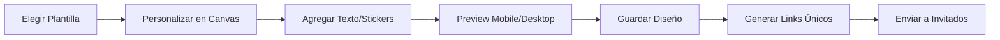

# EventHub — Plan Detallado de Implementación

Plataforma SaaS multi-tenant para la gestión integral de eventos sociales (bodas, 15 años, aniversarios, corporativos). El sistema ofrece herramientas profesionales para organizadores (dashboard, invitaciones con editor drag & drop, distribución de mesas, galería de fotos, comunicaciones) y una experiencia mobile-first elegante para invitados.

> [!IMPORTANT]
> Este plan se basa en el PRD-EventHub.md con la aclaración del usuario: las invitaciones deben poder armarse con un **editor drag & drop de plantillas**, inspirado en [GreetingsIsland.com](https://www.greetingsisland.com/).

## Referencia Visual — GreetingsIsland Editor

El editor de invitaciones de GreetingsIsland muestra la experiencia de referencia que debemos replicar:

````carousel

<!-- slide -->

````

---

## Decisiones Confirmadas

| Decisión | Resolución |
|----------|------------|
| Stack tecnológico | ✅ Next.js 14+ App Router + Tailwind + shadcn/ui + Supabase |
| Editor invitaciones | ✅ **Fabric.js** (MIT, gratuita, canvas-based) |
| Deploy | 🖥️ **Desarrollo local primero** (Node.js en PC del usuario) |
| Alcance | 🎯 **MVP** (sección 9.1 del PRD) |
| Plantillas | 📋 **Pre-diseñadas** + customización D&D. Idea futura: generar fondos con IA |
| Pagos/Suscripciones | 💳 **Incluido en V1** — el owner del sistema puede modificar planes, valores y features |
| API keys | 🔑 Se solicitarán cuando sean necesarias |
| Moderación fotos | ✅ Ambas opciones: manual + auto-aprobación (toggle por evento) |

> [!IMPORTANT]
> **Rol de System Owner (Super Admin):** Existe un rol por encima de todos los Tenant Owners — es el dueño del sistema completo. Puede gestionar planes, precios, features habilitados, y tiene acceso global a todos los tenants. Este es el usuario del cliente (el dueño del negocio EventHub).

---

## Proposed Changes

La implementación está organizada en 5 fases, siguiendo el roadmap del PRD pero con ajustes para incorporar el editor de invitaciones drag & drop.

---

### Fase 1 — Fundación (Semanas 1-4)

Configuración del proyecto, base de datos, autenticación y multi-tenancy.

---

#### [NEW] Proyecto Next.js

Inicialización del proyecto completo con el stack definido en el PRD.

```
eventhub/
├── src/
│   ├── app/                    # App Router (Next.js 14+)
│   │   ├── (auth)/            # Rutas de autenticación
│   │   │   ├── login/
│   │   │   ├── register/
│   │   │   └── layout.tsx
│   │   ├── (admin)/           # ★ Panel System Owner (super admin)
│   │   │   ├── tenants/       # Gestión de todos los tenants
│   │   │   ├── plans/         # Gestión de planes y precios
│   │   │   ├── templates/     # Gestión de plantillas de invitación
│   │   │   ├── analytics/     # Métricas globales de la plataforma
│   │   │   └── layout.tsx
│   │   ├── (dashboard)/       # Panel del organizador (tenant)
│   │   │   ├── events/
│   │   │   ├── guests/
│   │   │   ├── tables/
│   │   │   ├── invitations/   # ← Editor drag & drop
│   │   │   ├── photos/
│   │   │   ├── communications/
│   │   │   ├── reports/
│   │   │   └── layout.tsx
│   │   ├── (guest)/           # Vista del invitado
│   │   │   ├── i/[token]/     # Página pública de invitación
│   │   │   └── layout.tsx
│   │   ├── api/               # API Routes
│   │   │   ├── admin/         # ★ Endpoints del super admin
│   │   │   ├── auth/
│   │   │   ├── events/
│   │   │   ├── guests/
│   │   │   ├── tables/
│   │   │   ├── photos/
│   │   │   ├── invitations/
│   │   │   └── communications/
│   │   ├── layout.tsx
│   │   └── page.tsx           # Landing page
│   ├── components/
│   │   ├── ui/                # shadcn/ui components
│   │   ├── admin/             # ★ Componentes del panel admin
│   │   ├── dashboard/
│   │   ├── invitation-editor/ # Editor drag & drop (Fabric.js)
│   │   ├── table-editor/
│   │   ├── photo-gallery/
│   │   └── guest/
│   ├── lib/
│   │   ├── supabase/
│   │   ├── auth/
│   │   ├── hooks/
│   │   ├── utils/
│   │   └── types/
│   ├── emails/                # Templates react-email
│   └── styles/
│       └── globals.css
├── public/
│   ├── templates/             # Assets de plantillas de invitación
│   └── stickers/              # Stickers decorativos
├── supabase/
│   ├── migrations/
│   └── seed.sql
├── next.config.js
├── tailwind.config.ts
├── tsconfig.json
└── package.json
```

#### [NEW] Schema de Base de Datos — Supabase PostgreSQL

```sql
-- ★ System Admins (dueños del sistema EventHub)
CREATE TABLE system_admins (
  id UUID PRIMARY KEY DEFAULT gen_random_uuid(),
  email VARCHAR(255) UNIQUE NOT NULL,
  password_hash VARCHAR(255) NOT NULL,
  full_name VARCHAR(255),
  is_active BOOLEAN DEFAULT true,
  created_at TIMESTAMPTZ DEFAULT NOW()
);

-- ★ Subscription Plans (gestionados por el System Owner)
CREATE TABLE subscription_plans (
  id UUID PRIMARY KEY DEFAULT gen_random_uuid(),
  name VARCHAR(50) NOT NULL,           -- "Free", "Pro", "Enterprise"
  slug VARCHAR(20) UNIQUE NOT NULL,    -- "free", "pro", "enterprise"
  price_usd DECIMAL(10,2) DEFAULT 0,   -- precio por evento
  max_guests INTEGER DEFAULT 50,
  max_events INTEGER DEFAULT 1,
  storage_quota_mb INTEGER DEFAULT 500,
  features JSONB DEFAULT '{}',         -- { "tables": true, "ai_suggestions": false, ... }
  is_active BOOLEAN DEFAULT true,
  sort_order INTEGER DEFAULT 0,
  created_at TIMESTAMPTZ DEFAULT NOW(),
  updated_at TIMESTAMPTZ DEFAULT NOW()
);

-- Tenants (organizaciones/cuentas)
CREATE TABLE tenants (
  id UUID PRIMARY KEY DEFAULT gen_random_uuid(),
  name VARCHAR(255) NOT NULL,
  plan_id UUID REFERENCES subscription_plans(id),  -- ★ FK al plan dinámico
  storage_used_mb INTEGER DEFAULT 0,
  created_at TIMESTAMPTZ DEFAULT NOW(),
  updated_at TIMESTAMPTZ DEFAULT NOW()
);

-- Users (organizadores dentro de un tenant)
CREATE TABLE users (
  id UUID PRIMARY KEY DEFAULT gen_random_uuid(),
  tenant_id UUID NOT NULL REFERENCES tenants(id) ON DELETE CASCADE,
  email VARCHAR(255) UNIQUE NOT NULL,
  password_hash VARCHAR(255) NOT NULL,
  full_name VARCHAR(255),
  role VARCHAR(20) DEFAULT 'organizer', -- tenant_owner, organizer, collaborator
  permissions JSONB DEFAULT '{}',
  created_at TIMESTAMPTZ DEFAULT NOW()
);

-- Events
CREATE TABLE events (
  id UUID PRIMARY KEY DEFAULT gen_random_uuid(),
  tenant_id UUID NOT NULL REFERENCES tenants(id) ON DELETE CASCADE,
  name VARCHAR(255) NOT NULL,
  event_type VARCHAR(50), -- wedding, quinceanera, birthday, corporate, other
  date TIMESTAMPTZ,
  end_date TIMESTAMPTZ,
  location_name VARCHAR(255),
  location_address TEXT,
  location_coordinates POINT,
  dress_code VARCHAR(100),
  custom_message TEXT,
  max_guests INTEGER DEFAULT 50,
  status VARCHAR(20) DEFAULT 'draft', -- draft, active, completed, archived
  settings JSONB DEFAULT '{}', -- branding, notifications config, etc.
  invitation_design JSONB, -- almacena el diseño del editor drag & drop
  created_by UUID REFERENCES users(id),
  created_at TIMESTAMPTZ DEFAULT NOW(),
  updated_at TIMESTAMPTZ DEFAULT NOW()
);

-- Guests (invitados)
CREATE TABLE guests (
  id UUID PRIMARY KEY DEFAULT gen_random_uuid(),
  event_id UUID NOT NULL REFERENCES events(id) ON DELETE CASCADE,
  full_name VARCHAR(255) NOT NULL,
  email VARCHAR(255),
  phone VARCHAR(50),
  invitation_token UUID UNIQUE DEFAULT gen_random_uuid(),
  rsvp_status VARCHAR(20) DEFAULT 'pending', -- pending, confirmed, declined, tentative
  plus_ones_allowed INTEGER DEFAULT 0,
  plus_ones_confirmed INTEGER DEFAULT 0,
  plus_ones_names JSONB DEFAULT '[]',
  dietary_restrictions JSONB DEFAULT '{}',
  group_name VARCHAR(100), -- familia, amigos, trabajo, etc.
  table_assignment_id UUID REFERENCES tables(id) ON DELETE SET NULL,
  custom_fields JSONB DEFAULT '{}',
  invitation_sent_at TIMESTAMPTZ,
  invitation_opened_at TIMESTAMPTZ,
  responded_at TIMESTAMPTZ,
  notes TEXT,
  created_at TIMESTAMPTZ DEFAULT NOW()
);

-- Tables (mesas)
CREATE TABLE tables (
  id UUID PRIMARY KEY DEFAULT gen_random_uuid(),
  event_id UUID NOT NULL REFERENCES events(id) ON DELETE CASCADE,
  table_number INTEGER NOT NULL,
  label VARCHAR(100), -- "Mesa VIP", "Mesa Familia", etc.
  capacity INTEGER DEFAULT 8,
  shape VARCHAR(20) DEFAULT 'round', -- round, rectangular, square
  x_position FLOAT DEFAULT 0,
  y_position FLOAT DEFAULT 0,
  rotation FLOAT DEFAULT 0,
  notes TEXT,
  created_at TIMESTAMPTZ DEFAULT NOW()
);

-- Photos
CREATE TABLE photos (
  id UUID PRIMARY KEY DEFAULT gen_random_uuid(),
  event_id UUID NOT NULL REFERENCES events(id) ON DELETE CASCADE,
  uploaded_by_guest_id UUID REFERENCES guests(id),
  file_path TEXT NOT NULL, -- S3/R2 key
  thumbnail_path TEXT,
  file_size_bytes BIGINT,
  moderation_status VARCHAR(20) DEFAULT 'pending', -- pending, approved, rejected
  metadata JSONB DEFAULT '{}', -- dimensions, original_filename, etc.
  uploaded_at TIMESTAMPTZ DEFAULT NOW()
);

-- Communications
CREATE TABLE communications (
  id UUID PRIMARY KEY DEFAULT gen_random_uuid(),
  event_id UUID NOT NULL REFERENCES events(id) ON DELETE CASCADE,
  type VARCHAR(30) NOT NULL, -- invitation, reminder, announcement
  subject VARCHAR(255),
  content TEXT,
  template_html TEXT,
  sent_at TIMESTAMPTZ,
  scheduled_at TIMESTAMPTZ,
  recipients_count INTEGER DEFAULT 0,
  status VARCHAR(20) DEFAULT 'draft', -- draft, scheduled, sent, failed
  metadata JSONB DEFAULT '{}', -- delivery stats
  created_at TIMESTAMPTZ DEFAULT NOW()
);

-- Invitation Templates (plantillas prediseñadas)
CREATE TABLE invitation_templates (
  id UUID PRIMARY KEY DEFAULT gen_random_uuid(),
  name VARCHAR(255) NOT NULL,
  category VARCHAR(50), -- wedding, quinceanera, birthday, corporate
  thumbnail_url TEXT,
  design_data JSONB NOT NULL, -- estructura del canvas, elementos, posiciones
  is_premium BOOLEAN DEFAULT false,
  is_active BOOLEAN DEFAULT true,
  sort_order INTEGER DEFAULT 0,
  created_at TIMESTAMPTZ DEFAULT NOW()
);

-- Guest Conflicts (restricciones de mesas)
CREATE TABLE guest_conflicts (
  id UUID PRIMARY KEY DEFAULT gen_random_uuid(),
  event_id UUID NOT NULL REFERENCES events(id) ON DELETE CASCADE,
  guest_a_id UUID NOT NULL REFERENCES guests(id) ON DELETE CASCADE,
  guest_b_id UUID NOT NULL REFERENCES guests(id) ON DELETE CASCADE,
  conflict_type VARCHAR(20) DEFAULT 'cannot_sit', -- cannot_sit, must_sit_together
  created_at TIMESTAMPTZ DEFAULT NOW(),
  UNIQUE(guest_a_id, guest_b_id)
);

-- Checklist Items
CREATE TABLE checklist_items (
  id UUID PRIMARY KEY DEFAULT gen_random_uuid(),
  event_id UUID NOT NULL REFERENCES events(id) ON DELETE CASCADE,
  title VARCHAR(255) NOT NULL,
  description TEXT,
  is_completed BOOLEAN DEFAULT false,
  sort_order INTEGER DEFAULT 0,
  due_date TIMESTAMPTZ,
  completed_at TIMESTAMPTZ,
  created_at TIMESTAMPTZ DEFAULT NOW()
);

-- RLS Policies
ALTER TABLE events ENABLE ROW LEVEL SECURITY;
ALTER TABLE guests ENABLE ROW LEVEL SECURITY;
ALTER TABLE tables ENABLE ROW LEVEL SECURITY;
ALTER TABLE photos ENABLE ROW LEVEL SECURITY;
ALTER TABLE communications ENABLE ROW LEVEL SECURITY;

-- Índices críticos
CREATE INDEX idx_events_tenant ON events(tenant_id);
CREATE INDEX idx_guests_event ON guests(event_id);
CREATE INDEX idx_guests_token ON guests(invitation_token);
CREATE INDEX idx_guests_rsvp ON guests(event_id, rsvp_status);
CREATE INDEX idx_photos_event ON photos(event_id);
CREATE INDEX idx_photos_moderation ON photos(event_id, moderation_status);
CREATE INDEX idx_tables_event ON tables(event_id);
```

#### [NEW] Sistema de Autenticación

- **System Owner**: Login separado en `/admin` — credenciales en `system_admins`
- **Organizadores**: Registro con email/password usando Supabase Auth
- **Invitados**: Acceso sin password mediante token único en URL (`/i/{token}`)
- Middleware de Next.js para proteger rutas (`/admin/*` → system_admin, `/dashboard/*` → tenant user)
- JWT con claims de `tenant_id`, `role`, `permissions`

#### [NEW] Panel de System Owner (`/admin`)

- **Gestión de Planes**: CRUD de planes de suscripción (nombre, precio, límites, features habilitados)
- **Gestión de Tenants**: Ver todos los tenants registrados, cambiar plan, suspender cuenta
- **Gestión de Plantillas**: Subir/editar/eliminar plantillas de invitación prediseñadas
- **Analíticas Globales**: Métricas de la plataforma (total tenants, eventos activos, revenue estimado)
- Acceso completo a cualquier tenant para soporte

---

### Fase 2 — Core MVP (Semanas 5-8)

Gestión de invitados y el editor de invitaciones drag & drop.

---

#### [NEW] Dashboard del Organizador

- Layout con sidebar colapsable (Home, Guests, Tables, Invitations, Photos, Communications, Reports)
- Métricas rápidas: confirmados, pendientes, tasa de confirmación, fotos subidas
- Notificaciones recientes (últimas confirmaciones/rechazos)
- Checklist inteligente con progreso visual

#### [NEW] Gestión de Invitados (`/dashboard/guests`)

- Tabla con virtual scrolling (TanStack Table)
- CRUD completo: alta manual, edición, eliminación
- Importación CSV con validación y mapeo de columnas
- Filtros: por estado RSVP, grupo, restricción alimenticia, mesa
- Búsqueda full-text
- Acciones bulk: selección múltiple + enviar invitación, asignar mesa
- Exportación CSV

#### [NEW] Editor de Invitaciones Drag & Drop (`/dashboard/invitations`)

> [!IMPORTANT]
> Esta es la funcionalidad clave inspirada en GreetingsIsland. El editor permite crear invitaciones visualmente atractivas usando plantillas y personalización libre.

**Arquitectura del Editor:**

```
┌─────────────────────────────────────────────────────────────┐
│  ← Volver    Text   Sticker   Image   Backgrounds   Next → │
├───────────────┬─────────────────────────────────────────────┤
│               │                                             │
│  Panel        │         Canvas Central                      │
│  Lateral      │         (Fabric.js / Canvas 2D)             │
│               │                                             │
│  - Templates  │    ┌─────────────────────────┐              │
│  - Elementos  │    │                         │              │
│  - Capas      │    │   Texto editable        │              │
│  - Config     │    │   Stickers movibles     │              │
│               │    │   Imágenes              │              │
│               │    │   Fondos                │              │
│               │    │                         │              │
│               │    └─────────────────────────┘              │
│               │                                             │
│               │    [Zoom -] ──●── [Zoom +]                  │
│               │                                             │
└───────────────┴─────────────────────────────────────────────┘
```

**Componentes del Editor:**

1. **Galería de Plantillas** — Selección inicial categorizada (Bodas, 15 Años, Cumpleaños, Corporativos)
2. **Canvas WYSIWYG** — Implementado con **Fabric.js** (canvas-based, soporte drag & drop nativo)
3. **Toolbar Superior** — Botones: Texto, Sticker, Imagen, Fondos, Undo/Redo, Zoom, Guardar, Preview
4. **Panel de Propiedades** — Al seleccionar un elemento: fuente, tamaño, color, opacidad, rotación, capas
5. **Librería de Stickers** — Elementos decorativos organizados por categoría (florales, marcos, íconos)
6. **Variables Dinámicas** — Insertar `{nombre_invitado}`, `{fecha}`, `{lugar}` que se reemplazan al generar
7. **Preview** — Vista previa en mobile y desktop antes de enviar
8. **Exportación** — Generar imagen JPG/PNG de la invitación para compartir o imprimir

**Flujo del Editor:**



**Modelo de datos del diseño (JSONB):**

```json
{
  "canvas": {
    "width": 600,
    "height": 900,
    "backgroundColor": "#FFF8F0"
  },
  "elements": [
    {
      "type": "text",
      "content": "Estás cordialmente invitado/a",
      "x": 150, "y": 100,
      "fontSize": 18, "fontFamily": "Playfair Display",
      "color": "#333333",
      "textAlign": "center"
    },
    {
      "type": "text",
      "content": "{nombre_invitado}",
      "x": 150, "y": 250,
      "fontSize": 32, "fontFamily": "Great Vibes",
      "color": "#B8860B",
      "isDynamic": true
    },
    {
      "type": "image",
      "src": "/stickers/floral-corner-01.png",
      "x": 0, "y": 0,
      "width": 200, "height": 200,
      "rotation": 0
    },
    {
      "type": "image",
      "src": "uploaded/user-photo.jpg",
      "x": 200, "y": 300,
      "width": 200, "height": 200,
      "filters": { "opacity": 0.9 }
    }
  ],
  "background": {
    "type": "image",
    "src": "/backgrounds/elegant-cream.jpg"
  }
}
```

#### [NEW] Página del Invitado (`/i/[token]`)

- Landing personalizada con los datos del evento
- Diseño responsivo mobile-first
- Detalles: fecha, hora, ubicación con mapa, dress code, mensaje personalizado
- Formulario de RSVP: confirmar/rechazar, plus ones, preferencias alimenticias
- Botón "Agregar al calendario" (iCal/Google Calendar)
- Acceso al portal de fotos (si está habilitado)
- Sin necesidad de crear cuenta

---

### Fase 3 — Features Estrella (Semanas 9-12)

Portal de fotos y gestión visual de mesas.

---

#### [NEW] Portal de Fotos Colaborativo (`/dashboard/photos` + `/i/[token]/photos`)

**Para Invitados:**
- Drag & drop múltiple o click para seleccionar
- Compresión client-side con `browser-image-compression` (~70% reducción)
- Progress bar por foto
- Límite configurable (20 fotos/invitado, 10MB/foto)
- Galería compartida con lazy loading (Intersection Observer)
- Modo slideshow

**Para Organizadores:**
- Interfaz de moderación rápida (aprobar/rechazar en batch)
- Dashboard de uso de storage
- Descarga masiva (ZIP generado en background)
- Opción auto-aprobar

**Storage:**
- Cloudflare R2 (S3-compatible, sin egress fees)
- Estructura: `/{tenant_id}/{event_id}/photos/original/` y `/thumbnail/`
- Thumbnails: 300px width, quality 80
- CDN para servir imágenes

#### [NEW] Gestión Visual de Mesas (`/dashboard/tables`)

- Canvas interactivo con **dnd-kit** para drag & drop
- Agregar/eliminar mesas con formas (redonda, rectangular, cuadrada)
- Definir capacidad por mesa
- Etiquetas personalizadas (Mesa VIP, Mesa Familia)
- Sidebar con invitados sin asignar → arrastrar a mesas
- Sistema de restricciones (no juntar / juntar obligatorios)
- Alertas visuales de conflictos (mesa en rojo)
- Exportación PDF (seating chart) y lista por mesa

#### [NEW] Preferencias Alimenticias

- Formulario en confirmación del invitado: vegetariano, vegano, celíaco, alergias
- Dashboard de resumen de catering con gráficos
- Exportación CSV por mesa para el proveedor de catering

---

### Fase 4 — Comunicaciones y Reportes (Semanas 13-16)

---

#### [NEW] Sistema de Comunicaciones (`/dashboard/communications`)

- **Tipos**: invitación inicial, recordatorios, anuncios
- **Editor WYSIWYG**: simple para contenido del email
- **Variables dinámicas**: `{nombre}`, `{fecha}`, `{lugar}`, `{link_confirmación}`
- **Preview**: mobile/desktop
- **Scheduling**: envío programado por fecha/hora
- **Envío masivo con queue**: (BullMQ o Supabase Edge Functions)
- **Métricas**: enviados, abiertos, clicks
- **Integración con Resend**: (react-email para templates)

#### [NEW] Dashboard de Analíticas (`/dashboard/reports`)

- KPIs: tasa de confirmación, tiempo promedio de respuesta, plus ones, fotos
- Gráficos con Recharts: timeline de confirmaciones, distribución por mesa, restricciones alimenticias (pie chart)
- Exportaciones: PDF completo, CSV de confirmados, etiquetas para souvenirs

#### [NEW] Checklist Inteligente

- Tareas auto-generadas al crear un evento
- Progreso visual con barra de progreso
- Fechas sugeridas basadas en la fecha del evento

---

### Fase 5 — Pulido y Lanzamiento

---

#### [MODIFY] Tema y Branding

- Light/Dark mode con `prefers-color-scheme` + toggle manual
- Variables CSS para customización por evento (plan premium)
- Transiciones suaves entre temas

#### [NEW] Optimizaciones Mobile

- Bottom navigation para invitados
- Swipe gestures en galería
- Botones grandes (min 44x44px)
- Pull to refresh en listas
- PWA manifest para instalación

#### [NEW] Testing y Deploy

- Tests unitarios con Vitest
- Tests E2E con Playwright (flujos críticos: registro, crear evento, enviar invitación, confirmar RSVP)
- Deploy: Vercel (frontend + API) + Supabase (DB + Auth + Storage)

---

## Librerías y Dependencias Principales

| Categoría | Librería | Uso |
|-----------|----------|-----|
| Framework | Next.js 14+ | App Router, SSR, API Routes |
| UI Components | shadcn/ui + Radix UI | Componentes accesibles |
| Styling | Tailwind CSS | Utilidades CSS |
| State | Zustand | Estado global ligero |
| Server State | TanStack Query | Cache y sync de datos |
| Forms | React Hook Form + Zod | Formularios con validación |
| Invitation Editor | Fabric.js | Canvas drag & drop |
| Table Editor | dnd-kit | Drag & drop mesas |
| Charts | Recharts | Gráficos del dashboard |
| Maps | Google Maps API | Mapa de ubicación |
| Email | Resend + react-email | Envío y templates de email |
| Storage | Cloudflare R2 (S3 SDK) | Almacenamiento de fotos |
| Image Compression | browser-image-compression | Compresión client-side |
| Virtual List | TanStack Virtual | Lista de invitados |
| PDF | @react-pdf/renderer | Exportación PDF |
| Auth | Supabase Auth | Autenticación |
| DB | Supabase (PostgreSQL) | Base de datos + RLS |

---

## Estimation de Tiempos

| Fase | Semanas | Descripción |
|------|---------|-------------|
| Fase 1 | 1-4 | Fundación: proyecto, DB, auth, multi-tenancy |
| Fase 2 | 5-8 | Core: invitados, editor invitaciones D&D, página invitado |
| Fase 3 | 9-12 | Features: fotos, mesas, preferencias alimenticias |
| Fase 4 | 13-16 | Comunicaciones, reportes, analíticas |
| Fase 5 | 17-18 | Pulido, testing, deploy |
| **Total** | **~18 semanas** | |

---

## Verification Plan

### Automated Tests

**Unit Tests (Vitest):**
```bash
npm run test
```
- Funciones utilitarias (generación de tokens, validación de datos)
- Hooks personalizados
- Lógica del editor de invitaciones (serialización/deserialización de diseños)
- Cálculos de métricas del dashboard

**E2E Tests (Playwright):**
```bash
npx playwright test
```
- Flujo de registro de organizador
- Creación de evento
- Alta de invitados (manual y CSV)
- Editor de invitaciones: crear diseño, agregar elementos, guardar
- Página del invitado: confirmar/rechazar asistencia
- Portal de fotos: subir y ver fotos
- Gestión de mesas: crear mesa, asignar invitados

### Manual Verification

1. **Registro y Login**: Crear cuenta → verificar acceso al dashboard → verificar multi-tenancy (datos aislados)
2. **Crear Evento**: Completar formulario → verificar que aparece en el dashboard
3. **Editor de Invitaciones**: Seleccionar plantilla → editar textos → agregar stickers → preview → guardar
4. **Enviar Invitación**: Generar link único → abrir en incógnito → verificar página del invitado
5. **RSVP**: Confirmar asistencia → verificar que se actualiza en el dashboard del organizador
6. **Fotos**: Subir foto como invitado → verificar moderación → aprobar → ver en galería
7. **Mesas**: Crear mesas → arrastrar invitados → verificar restricciones
8. **Mobile**: Acceder todas las vistas desde un dispositivo móvil → verificar responsive

> [!TIP]
> Se recomienda al usuario validar manualmente el editor de invitaciones en cada iteración, ya que es la funcionalidad más visual y compleja.
